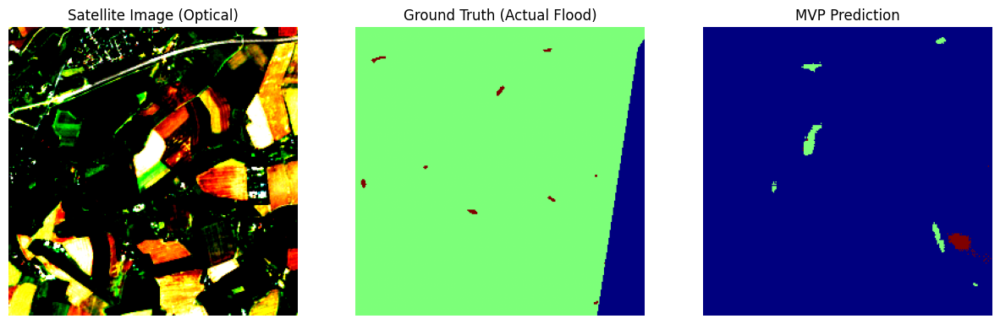
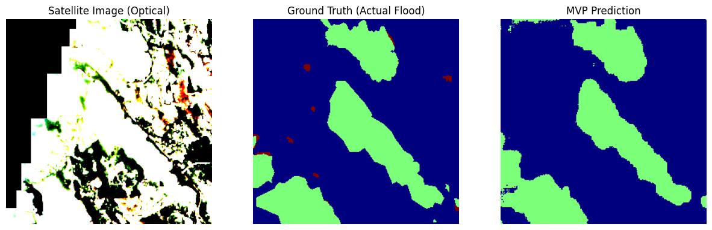
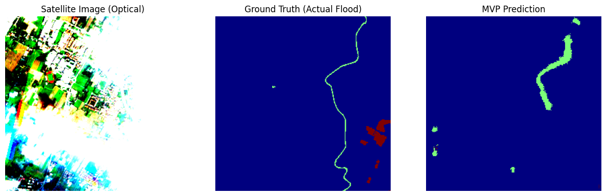
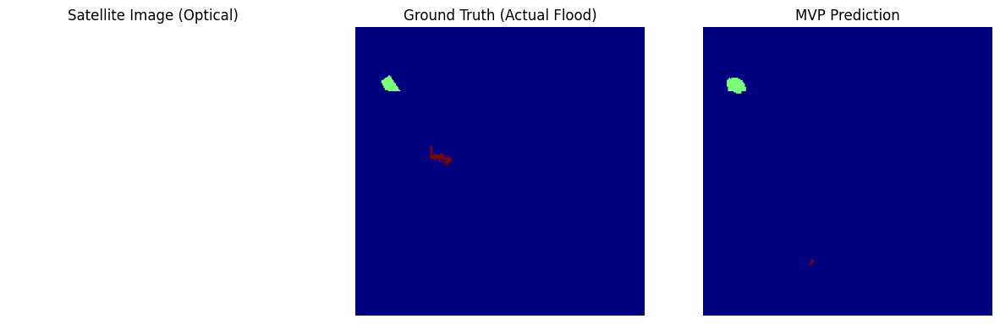
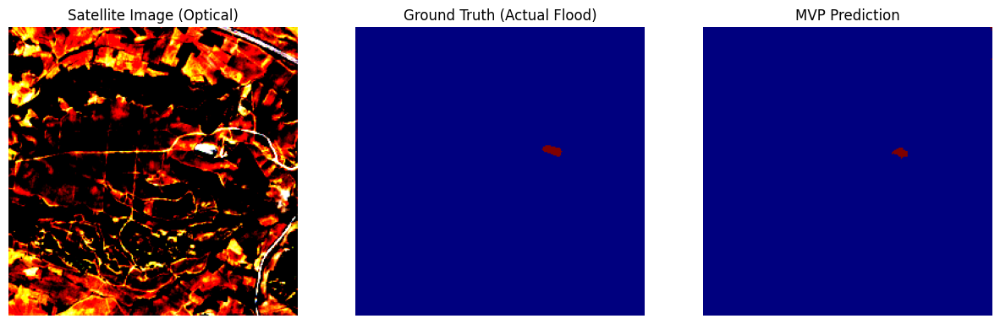
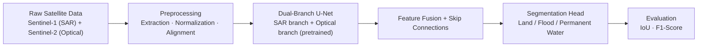
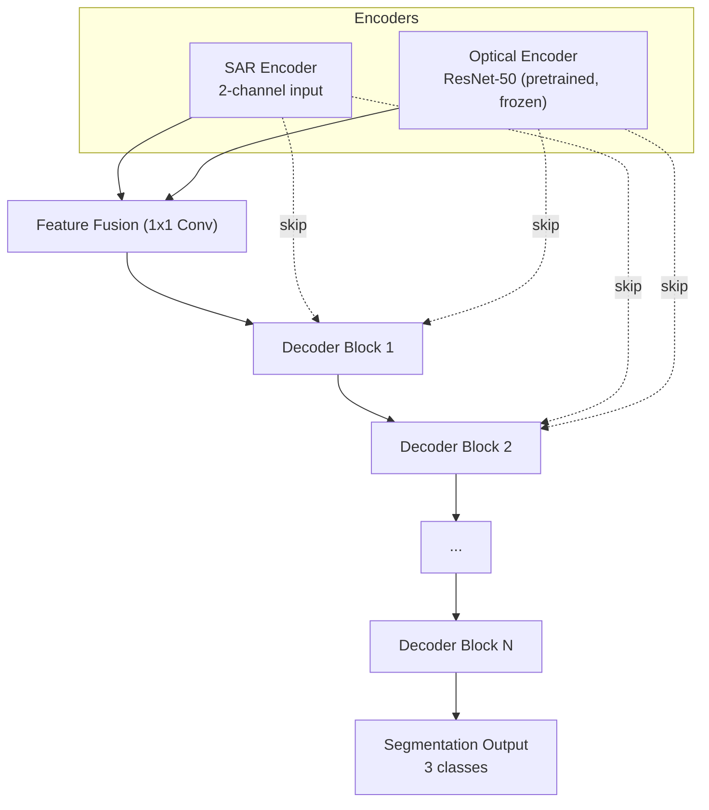

# 🌊 Flood Detection — Satellite Imagery Segmentation

A deep learning pipeline for pixel-level flood detection from satellite imagery, fusing **SAR (Sentinel-1)** and **optical (Sentinel-2)** data through a dual-branch U-Net architecture.

---

## 📊 Results

Evaluated on **3,889 held-out validation images**:

| Metric | Score |
| --- | --- |
| Mean Flood IoU | **46.23%** |
| Mean Flood F1-Score | **59.80%** |
| Best Validation Loss | 0.458 (Epoch 24) |

### Qualitative Results

| Optical → Ground Truth → Prediction | Notes |
| --- | --- |
|  | Detects small, scattered flood patches |
|  | Sharp boundaries on large connected flood zones |
|  | Tracks thin, winding river shapes without breaking continuity |
|  | Precise localization of small isolated flood regions |
|  | Correctly identifies negative (no-flood) cases |

**Current strengths:** large connected flood bodies (rivers, lakes, wide inundation) with clean, sharp boundaries.
**Current constraint:** very small, isolated flood pixels are harder to capture consistently — a known challenge for pixel-level segmentation at this class imbalance.

---

## 🧭 Pipeline Overview



---

## 🗂️ Dataset

- **Source:** [IBM-ESA ImpactMesh-Flood](https://huggingface.co/datasets/ibm-esa-geospatial/ImpactMesh-Flood)
- **Inputs:**
  - SAR (Sentinel-1): 2 channels — VV, VH
  - Optical (Sentinel-2, RGB): 3 channels
  - Ground truth masks: 3 classes (land / flood / permanent water) + a no-data label

### Preprocessing

- Extraction of `.tif` (mask, optical) and `.zarr.zip` (SAR) archives.
- **Normalization:**
  - SAR: scaled to [0, 1] using the real measured VV/VH value range from the dataset (empirically sampled, not assumed).
  - Optical: scaled to [0, 1], then normalized with ImageNet mean/std to match the pretrained backbone's expected input distribution.
- **Alignment verification:** sample ordering across SAR, optical, and mask arrays is explicitly checked before training.
- **Memory-mapped loading** (`np.load(mmap_mode="r")`) to keep memory usage stable on constrained environments.

---

## 🧠 Model Architecture

A **dual-branch U-Net** with independent encoders for SAR and optical inputs, fused into a shared decoder.



- **Optical branch:** uses ResNet-50 pretrained on ImageNet, with its native 3-channel `conv1` preserved (no weight discarding).
- **Skip connections:** carry high-resolution spatial detail from the encoders into the decoder, producing sharp object boundaries instead of blurred segmentation masks.
- **Frozen backbone:** most of the pretrained encoder is frozen to keep the model trainable under limited GPU memory.
- **Total parameters:** ~53.2M | **Trainable parameters:** ~6.2M

### Handling Class Imbalance

Flood pixels represent a small minority of the dataset. This is addressed via:

- **Computed class weights:** `[0.043, 2.275, 0.681]`
- **DiceBCE loss** (Cross-Entropy + Dice), with no-data pixels excluded from the loss computation.

---

## 🏋️ Training Configuration

| Setting | Value |
| --- | --- |
| Epochs | 30 (early stopping enabled) |
| Batch size | 8 |
| Best checkpoint | Epoch 24 |
| Precision | Mixed precision (`torch.amp`) |
| Hardware | Single GPU (Kaggle) |

---

## 🚀 Usage

**1. Install dependencies**

```bash
pip install -r requirements.txt
```

**2. Prepare the dataset**

Download and preprocess the [ImpactMesh-Flood](https://huggingface.co/datasets/ibm-esa-geospatial/ImpactMesh-Flood) dataset into `sar_ready.npy`, `optical_ready.npy`, and `mask_ready.npy`.

### 3. Train

```bash
python src/train_baseline.py \
    --sar path/to/sar_ready.npy \
    --optical path/to/optical_ready.npy \
    --mask path/to/mask_ready.npy \
    --epochs 30 --batch-size 8 --patience 8
```

**4. Evaluate**

```bash
python src/evaluate.py --checkpoint checkpoints/best_model.pth
```

---

## 📁 Project Structure

```text
flood-detection-cv/
├── src/
│   ├── dataset.py          # Data loading, normalization, augmentation
│   ├── models/
│   │   └── model.py        # Dual-branch U-Net architecture
│   ├── losses.py            # DiceBCE loss with class weighting
│   ├── metrics.py            # IoU / F1 computation for the flood class
│   ├── train_baseline.py     # Training loop, checkpointing, early stopping
│   └── evaluate.py           # Standalone evaluation on held-out data
├── checkpoints/              # Saved model weights (gitignored)
├── requirements.txt
└── main.py
```

---

## 🔭 Roadmap

- Reintroduce full 12-band Sentinel-2 (S2L2A) optical input on higher-storage infrastructure.
- Expand the held-out test set for more robust evaluation.
- Explore loss reweighting strategies to improve recall on small, isolated flood regions.
- Extend augmentation beyond horizontal/vertical flips (rotation, brightness/contrast jitter).

---

## 📜 License

Specify a license here (e.g., MIT) if this project is intended for public reuse.
